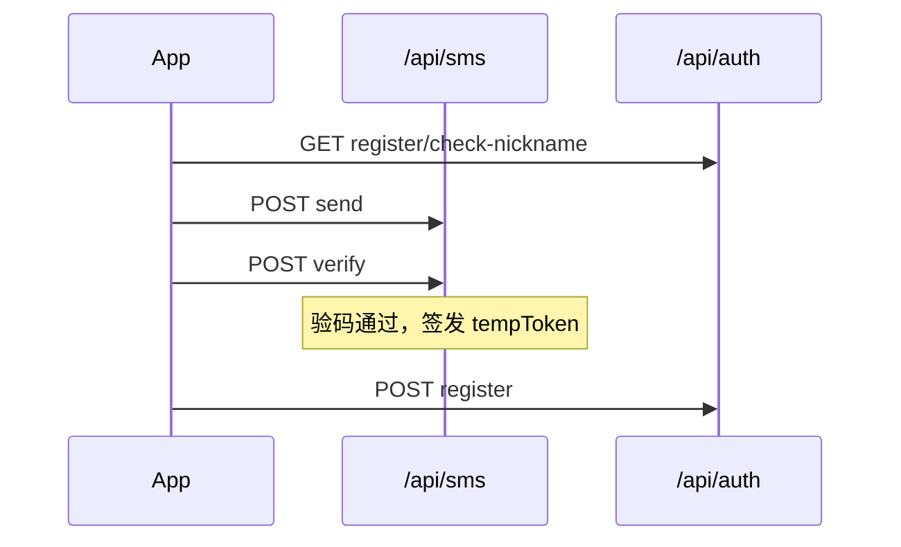

# Carpooling 后端

基于 **Node.js + Express** 的拼车项目 API：开发可在内网本机/局域网运行，测试可部署到公网；前端通过 `EXPO_PUBLIC_API_URL` 切换地址。

**约定**：查询用 **GET**，其余业务操作用 **POST**；POST 请求体为 JSON（`Content-Type: application/json`）。详细规范见项目根目录 [`CONTRIBUTING.md`](../CONTRIBUTING.md)。

---

## 目录

- [环境要求](#环境要求)
- [快速开始](#快速开始)
- [已实现接口](#已实现接口)
- [数据库](#数据库)
- [环境变量](#环境变量)
- [开发 / 测试环境切换](#开发--测试环境切换)
- [打包与部署](#打包与部署)
- [目录结构](#目录结构)
- [架构与规范索引](#架构与规范索引)

---

## 环境要求

| 依赖 | 说明 |
|------|------|
| **Node.js** | 18.x 或 20.x（LTS） |
| **MySQL** | 5.7+ 或 8.0+（用户等持久化数据） |

---

## 快速开始

在 **`backend/`** 目录执行：

```bash
npm install
cp .env.example .env
# Windows PowerShell: Copy-Item .env.example .env
```

1. 编辑 **`.env`**：至少配置 [环境变量](#环境变量) 中的阿里云 AK/SK 与 `DB_*`、`DATABASE_URL`（并先在 MySQL 中 [创建数据库](#数据库)）。  
2. 启动：`npm start` 或 `npm run dev`（默认监听 `0.0.0.0:3000`；可通过 `PORT` 覆盖，本项目公网示例常用 `3005`）。  
3. 探活：`curl http://localhost:3000/health` — 成功时返回 `status: ok` 与 `db_connected: true`；数据库不可用时 HTTP 500，正文为固定文案「数据库暂不可用」（不返回数据库内部错误信息）。  
4. 初始化 Prisma Client：`npm run prisma:generate`  
5. 若本地是首次接入已存在库，请按迁移文档执行 baseline（见 [`后端Prisma开发规范`](../docs/后端Prisma开发规范.md)）。
6. 短信联调说明见 [`docs/短信验证接口联调文档.md`](../docs/短信验证接口联调文档.md)。

---

## 已实现接口

所有业务 JSON 接口统一响应：`{ code, message, data, requestId }`（见 `src/utils/response.js`）。  
前端 `baseURL` 为 `${EXPO_PUBLIC_API_URL}/api`；请求头建议携带 `X-Request-Id`，鉴权接口携带 `Authorization: Bearer <token>`。

### 接口总览

| 模块 | 方法 | 路径 | 鉴权 | 说明 |
|------|------|------|------|------|
| 系统 | GET | `/health` | 否 | 健康检查（含 DB 连通性） |
| 系统 | POST | `/api` | 否 | API 占位 |
| 系统 | GET | `/uploads/{filename}` | 否 | 上传文件静态访问 |
| 短信 | POST | `/api/sms/send` | 否 | 发送验证码（阿里云 SDK，**注册场景**） |
| 短信 | POST | `/api/sms/verify` | 否 | 校验验证码（阿里云）；注册场景签发 `tempToken` |
| 认证 | GET | `/api/auth/login/config` | 否 | 登录页动态配置（logo、标题、第三方入口等） |
| 认证 | POST | `/api/auth/login/password` | 否 | 手机号 + 密码登录 |
| 认证 | POST | `/api/auth/login/social` | 否 | 第三方登录（wechat / qq / apple） |
| 认证 | POST | `/api/auth/check-phone` | 否 | 手机号检测（忘记密码等） |
| 认证 | POST | `/api/auth/password/sms` | 否 | 重置密码发码（内部 `type=reset_pwd`） |
| 认证 | POST | `/api/auth/sms/send` | 否 | 认证场景发码（login / register / reset_pwd，Redis 自管，内部用） |
| 认证 | GET | `/api/auth/demo-accounts` | 否 | 演示账号列表 |
| 认证 | GET | `/api/auth/captcha/image` | 否 | 图形验证码 |
| 认证 | POST | `/api/auth/risk/behavior-verify` | 否 | 行为验证 |
| 认证 | POST | `/api/auth/risk/device-score` | 否 | 设备风险评分 |
| 认证 | POST | `/api/auth/oauth/bind` | 否 | OAuth 账号绑定 |
| 认证 | GET | `/api/auth/register/check-nickname` | 否 | 注册前昵称可用性 |
| 认证 | POST | `/api/auth/register` | 否 | 提交注册（须 `tempToken`） |
| 用户 | POST | `/api/users/init-schema` | 内网/Token | Prisma 迁移后 DB 连通检查（兼容保留） |
| 用户 | POST | `/api/users/create` | — | **已废弃（410）**，请用 `/api/auth/register` |
| 上传 | POST | `/api/upload` | 否 | 单文件上传（`multipart/form-data`，字段 `file`） |
| 管理 | GET | `/api/admin/users` | 管理员 JWT | 分页用户列表 |
| 管理 | POST | `/api/admin/users/status` | 管理员 JWT | 更新用户状态（active / disabled） |
| 管理 | POST | `/api/admin/users/role` | 管理员 JWT | 更新用户角色（user / admin） |

> 路径规范详见 [`docs/接口汇总清单.md`](../docs/接口汇总清单.md)。

### 前后端路径联调状态

> 路径已按规范统一；关闭前端 Mock（`isMockMode=false`）后按下列状态验证。

| 状态 | 前端路径 | 后端路径 | 前端模块 | 备注 |
|------|----------|----------|----------|------|
| ✅ 已联调 | `GET /auth/register/check-nickname` | 同左 | `auth.ts` | 见 [用户注册联调文档](../docs/用户注册接口联调文档.md) |
| ✅ 已联调 | `POST /sms/send` | 同左 | `auth.ts` | 见 [短信联调文档](../docs/短信验证接口联调文档.md) |
| ✅ 已联调 | `POST /sms/verify` | 同左 | `auth.ts` | 注册验码 + `tempToken` |
| ✅ 已联调 | `POST /auth/register` | 同左 | `auth.ts` | 注册提交 |
| ⏳ 待联调 | `GET /auth/login/config` | 同左 | `auth.ts` | 路径已对齐 |
| ⏳ 待联调 | `POST /auth/login/password` | 同左 | `auth.ts` | 路径已对齐 |
| ⏳ 待联调 | `GET /admin/users` | 同左 | `admin-api.ts` | 需管理员 JWT |
| ⏳ 待联调 | `POST /admin/users/status` | 同左 | `admin-api.ts` | 需管理员 JWT |
| ⏳ 待联调 | `POST /admin/users/role` | 同左 | `admin-api.ts` | 需管理员 JWT |
| ⏳ 待联调 | `POST /auth/check-phone` | 同左 | `password-api.ts` | 路径已对齐 |
| ⏳ 待联调 | `POST /auth/password/sms` | 同左 | `password-api.ts` | 路径已对齐 |
| ❌ 后端缺失 | `POST /auth/password/verify-code` | — | `password-api.ts` | 忘记密码验码 |
| ❌ 后端缺失 | `POST /auth/password/reset` | — | `password-api.ts` | 重置密码提交 |
| ⏳ 待联调 | `POST /upload` | 同左 | `edit-vehicle-api.ts` | 见 [文件上传联调文档](../docs/文件上传接口联调文档.md) |

其余前端业务接口（首页、找车、行程、支付、通知、地点、车辆等）**后端尚未实现**，当前仅 Mock。

### 注册流程（已联调）

须按顺序：**昵称检测 → 阿里云发码 → 阿里云验码获 `tempToken` → 提交注册**。



要点：

- 发码：`POST /api/sms/send`（阿里云 SDK，与登录/重置场景的 Redis 发码分离）。
- 验码 + 临时令牌：`POST /api/sms/verify`。
- 重置密码发码：`POST /api/auth/password/sms`（等价于 `POST /api/auth/sms/send` 且 `type=reset_pwd`）。
- 注册提交只认 `tempToken`；昵称最长 30 字符；密码 8～20 位且须同时包含字母与数字。

完整请求体与错误码见 [`docs/用户注册接口联调文档.md`](../docs/用户注册接口联调文档.md)。

### 登录

**`GET /api/auth/login/config`**

- Query：`appVersion`、`platform`（如 `ios` / `android`）。
- 返回登录页 UI 配置（标题、副标题、可用第三方平台等）。

**`POST /api/auth/login/password`**

请求体：

```json
{
  "phone": "13812345678",
  "password": "your_password",
  "rememberMe": false
}
```

说明：`rememberMe=true` 时 token 有效期更长；成功返回 `token`、`refreshToken`、`userId`、`userName`、`avatarUrl`、`expireIn`。手机号或密码错误返回 **401**。

> 注册与登录共用 `auth_users` 表。注册成功返回 `accessToken` / `refreshToken`；密码登录成功返回 `token` / `refreshToken`（字段名不同，语义均为访问令牌）。

### 文件上传

**`POST /api/upload`**

- `Content-Type`：`multipart/form-data`
- 字段：`file`（单文件，JPG / PNG / WEBP，最大 5MB）
- 成功 `data.url` 为可访问路径（配合 `GET /uploads/{filename}`）

详见 [`docs/文件上传接口联调文档.md`](../docs/文件上传接口联调文档.md)。

### 管理后台

均需 **Bearer JWT** + **管理员角色**（`adminAuthMiddleware`）。

| 方法 | 路径 | 主要参数 |
|------|------|----------|
| GET | `/api/admin/users` | Query：`page`、`pageSize`、`phone`、`userName`、`role`、`status` |
| POST | `/api/admin/users/status` | Body：`targetUserId`、`status`（`active` / `disabled`） |
| POST | `/api/admin/users/role` | Body：`targetUserId`、`role`（`user` / `admin`） |

管理员账号创建与 SQL 提升见 [`docs/管理员系统设计文档.md`](../docs/管理员系统设计文档.md)。

### 用户 / 运维

**`POST /api/users/init-schema`**

无请求体。Prisma 迁移后不再运行时建表，仅做 DB 连通检查。成功示例：

```json
{
  "code": 200,
  "message": "操作成功",
  "data": {
    "initialized": true,
    "managedBy": "prisma-migrate"
  },
  "requestId": "RN-xxx"
}
```

访问限制：仅内网或携带 `x-schema-init-token: <SCHEMA_INIT_TOKEN>`。

**`POST /api/users/create`** — 已废弃，固定返回 **410**，请改用 `POST /api/auth/register`。

### 认证扩展（后端已实现，前端暂未对接）

以下接口已在 `auth-router` 注册，供登录风控、第三方登录等后续前端接入（**不含**已在 `password-api.ts` 对接的 `check-phone` / `password/sms`）：

- `POST /api/auth/login/social` — 第三方登录
- `GET /api/auth/demo-accounts` — 演示账号
- `GET /api/auth/captcha/image` — 图形验证码
- `POST /api/auth/risk/behavior-verify` — 行为验证
- `POST /api/auth/risk/device-score` — 设备评分
- `POST /api/auth/oauth/bind` — OAuth 绑定
- `POST /api/auth/sms/send` — Redis 自管发码（底层能力；App 重置密码请用 `/api/auth/password/sms`）

### 联调文档索引

| 文档 | 覆盖接口 |
|------|----------|
| [`docs/短信验证接口联调文档.md`](../docs/短信验证接口联调文档.md) | `/api/sms/*` |
| [`docs/用户注册接口联调文档.md`](../docs/用户注册接口联调文档.md) | 注册全流程 |
| [`docs/文件上传接口联调文档.md`](../docs/文件上传接口联调文档.md) | `POST /api/upload` |
| [`docs/管理员系统设计文档.md`](../docs/管理员系统设计文档.md) | `/api/admin/*` |

---

## 数据库

### 1. 创建库

```sql
CREATE DATABASE carpooling DEFAULT CHARACTER SET utf8mb4 COLLATE utf8mb4_unicode_ci;
```

### 2. 配置连接

在 **`.env`** 中设置 `DB_HOST`、`DB_PORT`、`DB_USER`、`DB_PASSWORD`、`DB_NAME`、`DB_CONNECTION_LIMIT`（见 [.env.example](.env.example)）。

同时设置 Prisma 连接串：`DATABASE_URL`（格式：`mysql://用户名:密码@主机:端口/数据库名`）。

### 3. 表结构迁移（Prisma）

不再使用运行时 `CREATE TABLE`。请通过 Prisma 迁移命令管理表结构：

```bash
npm run prisma:migrate:dev -- --name <migration-name>
npm run prisma:migrate:deploy
npm run prisma:migrate:status
```

首次接入已存在的 `auth_users` 表，请执行 baseline 流程（见 [`后端Prisma开发规范`](../docs/后端Prisma开发规范.md)）。

### `auth_users` 表字段（注册/登录统一）

> 说明：注册接口 `POST /api/auth/register` 与登录接口 `POST /api/auth/login/password` 均使用 `auth_users` 表。表结构由 **Prisma migration** 管理，不在运行时执行 DDL。

| 字段 | 类型 | 说明 |
|------|------|------|
| user_id | VARCHAR(64) | 登录用户 ID，主键 |
| phone | VARCHAR(20) | 登录手机号，唯一 |
| password_hash | VARCHAR(255) | 密码哈希（支持 sha256 / bcrypt） |
| user_name | VARCHAR(50) | 登录展示名 |
| avatar_url | VARCHAR(255) | 头像 URL |
| last_login_at | DATETIME | 最近登录时间 |
| last_login_device_info | TEXT | 最近登录设备信息（JSON 字符串） |
| role | VARCHAR(20) | 角色：`user` / `admin`，默认 `user` |
| status | VARCHAR(20) | 状态：`active` / `disabled`，默认 `active` |
| created_at | TIMESTAMP | 创建时间 |
| updated_at | TIMESTAMP | 更新时间 |

完整定义见 `backend/prisma/schema.prisma`。

---

## 环境变量

基于 **`.env.example`** 复制为 **`.env`**（已被 `.gitignore` 忽略，勿提交）。

**常用必填（按功能）**

| 变量 | 说明 |
|------|------|
| `ALIBABA_CLOUD_ACCESS_KEY_ID` / `ALIBABA_CLOUD_ACCESS_KEY_SECRET` | 阿里云短信相关能力 |
| `DB_HOST` / `DB_PORT` / `DB_USER` / `DB_PASSWORD` / `DB_NAME` | MySQL |
| `DATABASE_URL` | Prisma 数据库连接串（MySQL） |
| `JWT_SECRET` / `JWT_REFRESH_SECRET` | 登录鉴权签名密钥（后端启动必填） |
| `PORT` / `HOST` | 服务监听，默认 `3000` / `0.0.0.0` |

**可选**

| 变量 | 说明 |
|------|------|
| `DB_CONNECTION_LIMIT` | 连接池上限，默认 `10` |
| `NODE_ENV` | 如 `production`；影响日志级别等 |
| `ALLOW_RETURN_VERIFY_CODE` | 仅 `NODE_ENV=production` 时读取；`true` 时在发送验证码成功响应中带回 `verifyCode`（**仅联调，生产勿开**） |
| `SCHEMA_INIT_TOKEN` | 管理员执行 `init-schema` 的凭证（`action=apply` 必填） |

敏感配置可向内网负责人索取；完整字段表以 **`.env.example`** 为准。

---

## 开发 / 测试环境切换

| 环境 | 后端 | 前端 `EXPO_PUBLIC_API_URL` 示例 |
|------|------|----------------------------------|
| 开发 | 本机或局域网 `npm start` | `http://localhost:3000` 或 `http://192.168.x.x:3000` |
| 测试 | 公网服务器（HTTPS 域名） | `https://api-test.example.com` |

详见前端 [README「开发环境与测试环境」](../frontend/README.md#开发环境与测试环境内网--公网)。

---

## 打包与部署

测试环境部署在**腾讯云**时，推荐流程：本机 **`npm run build`** 生成 **`dist/`** → 上传至服务器目录 → 服务器 **`npm install --production`** → 配置环境变量 → **`npm start`** 或 PM2。详细步骤见 [`docs/后端打包与上传服务器流程.md`](../docs/后端打包与上传服务器流程.md)。

**dist 内容**：含 `src/`、`package.json`、`package-lock.json`；不含 `node_modules`、`.env`，需在目标机单独安装依赖并配置变量。

**公网建议**

- 仅对外暴露 **80/443**，反代到本进程（默认 `http://127.0.0.1:3000`；若你服务跑在 `3005`，请同步修改反代目标），由 Nginx/Caddy 提供 HTTPS。  
- 使用 PM2 或 systemd 守护进程。  
- 生产环境按需收紧 **CORS**（当前开发期多为 `origin: true`）。  
- 探活使用 **`GET /health`**。

---

## 目录结构

```
backend/
├── prisma/
│   ├── schema.prisma     # Prisma schema（数据库结构唯一真相）
│   └── migrations/       # Prisma 迁移文件（需提交Git）
├── src/
│   ├── config/          # prisma.js / load-env.js
│   ├── router/          # sms / auth / users / upload / admin
│   ├── controller/      # 对应 controller 层
│   ├── service/         # aliyun-sms / users / auth 等
│   ├── dao/             # user-dao.js 等（表结构以 prisma/schema.prisma 为准）
│   ├── utils/           # response.js, logger.js, jwt-utils.js, redis-utils.js 等
│   ├── middleware/      # auth-middleware.js, admin-auth-middleware.js, schema-init-guard.js
│   ├── constants/       # auth-constants.js、upload-constants.js 等
│   └── index.js
├── scripts/build.js     # npm run build → dist/
├── .env.example
├── package.json
└── README.md
```

---

## 架构与规范索引

- **分层**：`router` → `controller`（参数与响应）→ `service`（业务）→ `dao`（SQL），避免跨层混写业务。  
- **响应**：统一 `code` / `message` / `data` / `requestId`（见 `utils/response.js`）。  
- **日志**：统一 `utils/logger.js`，敏感字段脱敏；异常需打日志并返回标准错误体。  
- **提交信息**：`<type>(<scope>): <subject>`，见 `CONTRIBUTING.md` §4.2。

更多命名、接口方法、日志级别、Git 与 PR 规则以 **[`CONTRIBUTING.md`](../CONTRIBUTING.md)** 为准；API 路径规范见 **[`docs/接口汇总清单.md`](../docs/接口汇总清单.md)**。