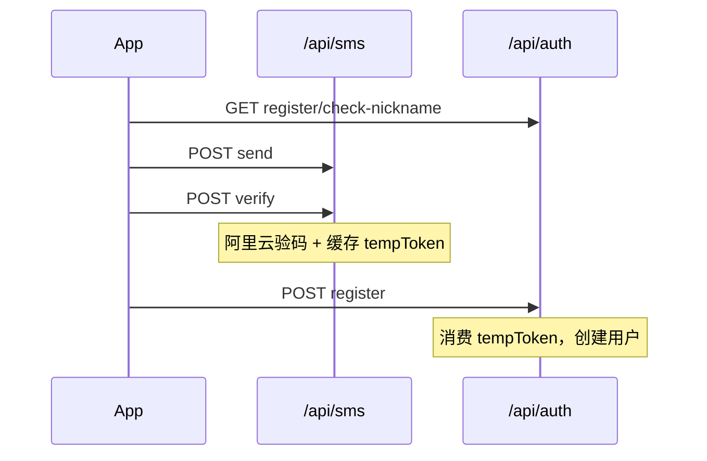

# 用户注册接口联调文档

## 1. 文档说明

- **适用范围**：App 端用户注册全流程联调
- **服务端实现**：短信 `sms-router` + 注册 `auth-router` → `auth-controller` → `auth-service`
- **响应结构**：统一 `code` / `message` / `data` / `requestId`
- **数据表**：`auth_users`（由 Prisma migration 管理，勿使用运行时 DDL）

## 2. 环境与基础地址

- 开发：`http://localhost:3000`（或 `.env` 中 `PORT`）
- 测试：由 `EXPO_PUBLIC_API_URL` 配置，路径前缀为 `/api`
- 阿里云凭据：`ALIBABA_CLOUD_ACCESS_KEY_ID` / `ALIBABA_CLOUD_ACCESS_KEY_SECRET`（见 `backend/.env.example`）
- 短信凭据仅配置后端 `ALIBABA_CLOUD_ACCESS_KEY_ID/SECRET`；签名/模板在阿里云控制台维护，联调时按 [短信验证接口联调文档.md](./短信验证接口联调文档.md) 在请求体中传入（可选字段由 SDK 转发）

所有请求建议携带 Header：`X-Request-Id: <链路 ID>`。

## 3. 短信与注册的分工

| 能力 | 接口 | 说明 |
|------|------|------|
| 发码（注册） | `POST /api/sms/send` | 阿里云 SDK，详见 [短信验证接口联调文档.md](./短信验证接口联调文档.md) |
| 验码 + 业务令牌 | `POST /api/sms/verify` | 阿里云验码通过后签发 `tempToken` |
| 其它场景发码（登录等） | `POST /api/auth/sms/send` | Redis 自管验证码（`type` 为 `login` / `register` / `reset_pwd`），**注册不用此接口** |
| 重置密码发码（App） | `POST /api/auth/password/sms` | 前端忘记密码页调用；后端等价于 `auth/sms/send` 且 `type=reset_pwd` |

## 4. 推荐调用顺序



| 步骤 | 方法 | 路径 | 说明 |
|------|------|------|------|
| 1 | GET | `/api/auth/register/check-nickname` | 昵称是否可用 |
| 2 | POST | `/api/sms/send` | 阿里云发码（请求体同 [短信验证接口联调文档.md](./短信验证接口联调文档.md)） |
| 3 | POST | `/api/sms/verify` | 阿里云验码 + 返回 `tempToken` |
| 4 | POST | `/api/auth/register` | 提交昵称、密码、`tempToken` |

## 5. 接口明细

### 5.1 昵称可用性

- **GET** `/api/auth/register/check-nickname`
- Query：`nickname`（必填；注册提交时最长 30 字符）

成功 `data`：

```json
{ "isAvailable": true }
```

### 5.2 校验验证码并签发临时令牌

- **POST** `/api/sms/verify`

请求体：

```json
{
  "phoneNumber": "13812345678",
  "verifyCode": "123456"
}
```

成功 `data`：

```json
{
  "isValid": true,
  "tempToken": "eyJhbGciOiJIUzI1NiIs..."
}
```

**服务端行为**：

- 调用阿里云 `checkVerifyCode`；
- `verifyResult` 为 `PASS`（或仅 `success=true`）视为通过；
- 生成 `tempToken` 并写入 Redis `register_temp:{phone}`，TTL **10 分钟**。

成功 `data` 除短信字段外包含：`isValid`、`tempToken`。

常见错误：

| HTTP | message |
|------|---------|
| 400 | 验证码校验失败 / 验证码错误 |
| 400 | 手机号格式不正确 |

### 5.3 提交注册

- **POST** `/api/auth/register`

请求体：

```json
{
  "nickname": "张三",
  "phoneNumber": "13812345678",
  "password": "abc12345",
  "tempToken": "eyJhbGciOiJIUzI1NiIs...",
  "agreeProtocol": true
}
```

校验规则（controller 层）：

| 字段 | 规则 |
|------|------|
| phoneNumber | 大陆 11 位手机号 |
| nickname | 非空，trim 后长度 ≤ 30 |
| password | 8～20 位，须同时包含字母与数字 |
| tempToken | 非空，须与 Redis `register_temp:{phone}` 一致 |
| agreeProtocol | 必须为 `true` |

成功 `data`：

```json
{
  "userId": "u_xxxxxxxx",
  "accessToken": "...",
  "refreshToken": "...",
  "userInfo": {
    "nickname": "张三",
    "avatarUrl": ""
  }
}
```

## 6. 已废弃 / 不适用

| 方法 | 路径 | 说明 |
|------|------|------|
| POST | `/api/users/create` | **410**，请用 `/api/auth/register` |
| POST | `/api/auth/register/verify-code` | **已移除**，请用 `/api/sms/verify` |

## 7. 前端对接参考

- API：`frontend/src/api/auth.ts`（`sendSmsCode` → `/sms/send`，`verifySmsCode` → `/sms/verify`）
- Hook：`frontend/src/hooks/use-register-form.ts`
- Mock 模式：不请求后端，本地返回 mock `tempToken`

**Token 使用说明**：

- 后端注册成功返回 `accessToken` 与 `refreshToken`。
- 当前前端 `use-register-form.ts` 仅将 `accessToken` 写入登录态；`refreshToken` 暂未持久化（后续可按登录页同样逻辑补齐）。
- 注册签发的 JWT payload 为 `{ userId, phone }`（不含 `role`）；若注册后需访问管理后台，须使用含 `role` 的登录 token（重新密码登录即可）。

发码请求体与短信联调文档一致（`phoneNumber`、`signName`、`templateCode`、`templateParam` 等），见 `frontend/src/api/auth.ts` 中 `sendSmsCode`。

## 8. 相关文档

- [短信验证接口联调文档.md](./短信验证接口联调文档.md)
- [backend/README.md](../../backend/README.md)
- [管理员系统设计文档.md](../system/管理员系统设计文档.md)
